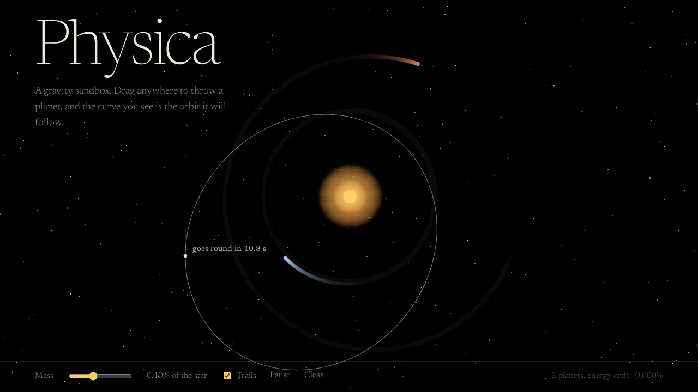

# Physica

A gravity sandbox. Drag anywhere in the sky to throw a planet at the star, and the curve you see is the orbit it will follow.



That curve is not the simulation run ahead in fast forward. Around a single mass, a body's path is always a conic section with the mass at one focus, so the whole orbit follows in closed form from the position and velocity at the moment of release. The ellipse is drawn in one stroke, it grows and turns as you aim, it snaps open when you cross escape velocity, and the label tells you the period from Kepler's third law. Let go and count: the planet comes back when it said it would.

Everything after that is honest N-body motion. Planets pull on each other and on the star, which is not nailed down, so a heavy throw makes the whole system wobble. Bodies that touch merge and conserve momentum. The reading along the bottom edge tracks total energy, which is the check on the integrator.

## Run it locally

```sh
npm install
npm run dev
```

`npm test` covers the physics: a circular orbit stays circular for a minute of simulated time, energy stays within a tiny band, momentum survives both stepping and merging, and the analytically drawn ellipse agrees with the numerical integrator after one full period.

## How it works

The write-up at the bottom of the page covers Newton's law and softening, why velocity Verlet keeps orbits stable where the obvious method does not, the orbital elements behind the predicted curve, and collisions. It also lives in [docs/how-it-works.md](docs/how-it-works.md).

## Built with

TypeScript, Vite and the Canvas 2D API. No physics library and no framework. KaTeX and marked render the write-up.
